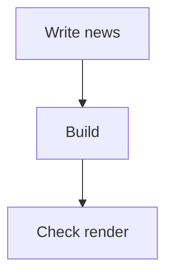

Quick paragraph to validate body text, **bold**, *italic*, and `inline code`.

## Headings

### Subheading level 3

| Element | Check |
| --- | --- |
| Table | OK |
| Figure | OK |

<figure>
  
  <figcaption>Figure 1. Simple image and caption test.</figcaption>
</figure>

```python
message = "Hello UI"
print(message)
```


