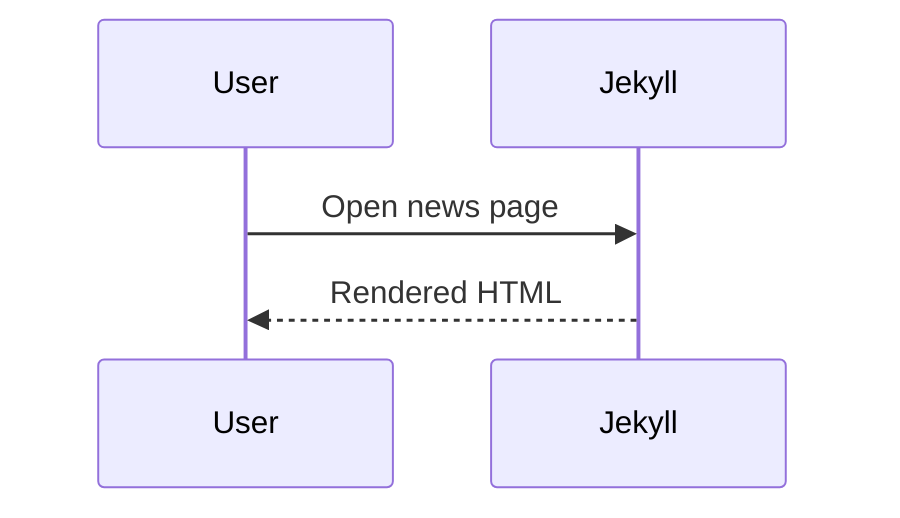

Second short entry for spacing and typography checks.

## Heading Example

### Compact table

| Metric | Value |
| --- | ---: |
| Accuracy | 0.94 |
| Recall | 0.92 |

<figure>
  
  <figcaption>Figure 2. Responsive width check.</figcaption>
</figure>

```javascript
const items = ["a", "b", "c"];
console.log(items.join(", "));
```


