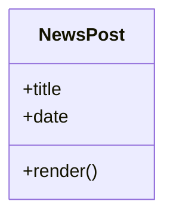

Third short post to test repeated UI components in the news feed.

## Main Heading

### Data table

| Item | Status |
| --- | --- |
| Code block | pass |
| Mermaid | pass |

<figure>
  
  <figcaption>Figure 3. Thumbnail style figure test.</figcaption>
</figure>

```bash
echo "news test"
bundle exec jekyll build
```


