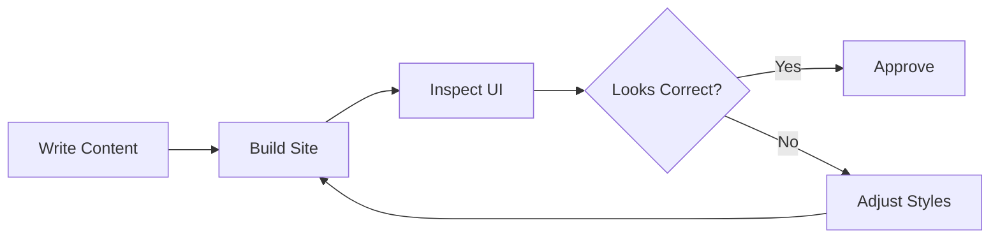

This post is a complete UI smoke test. It intentionally mixes common content blocks to validate typography, spacing, and component rendering.

## Heading Level 2

Regular paragraph text with **bold**, *italic*, and `inline code`.

### Heading Level 3

Blockquote example:

> The purpose of this document is to verify visual consistency across all content primitives.

#### Heading Level 4

Unordered list:

- First item
- Second item
- Third item

Ordered list:

1. Step one
2. Step two
3. Step three

## Table

| Component | Expected behavior | Status |
| --- | --- | --- |
| Headings | Proper scale and spacing | Pending |
| Table | Borders and alignment render correctly | Pending |
| Code | Syntax highlighting and scroll overflow | Pending |
| Mermaid | Diagram is converted and rendered | Pending |

## Figure

<figure class="text-center">
  
  <figcaption class="mt-2 text-muted">Figure 1. Placeholder image used to validate figure and caption styling.</figcaption>
</figure>

## Code Snippet

```python
from dataclasses import dataclass

@dataclass
class Metric:
    name: str
    value: float


def summarize(metrics: list[Metric]) -> str:
    lines = [f"{m.name}: {m.value:.2f}" for m in metrics]
    return "\n".join(lines)


if __name__ == "__main__":
    sample = [Metric("accuracy", 0.97), Metric("f1", 0.95)]
    print(summarize(sample))
```

## Mermaid Diagram



## Horizontal Rule

---

Final paragraph to confirm bottom spacing and readability.
