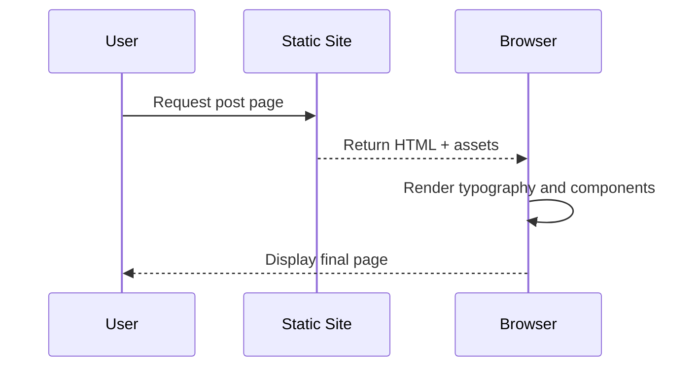

This second post stresses layout under denser content blocks and long lines.

## Headings and Text Blocks

### Introductory paragraph

Lorem ipsum dolor sit amet, consectetur adipiscing elit. Vestibulum in feugiat purus. Sed luctus velit at ante volutpat, quis placerat justo tincidunt.

### Nested emphasis

A sentence with **strong emphasis**, *inline emphasis*, and `inline code token` together.

## Table With Numeric Data

| Metric | Run A | Run B | Delta |
| --- | ---: | ---: | ---: |
| Accuracy | 0.931 | 0.944 | +0.013 |
| Precision | 0.908 | 0.919 | +0.011 |
| Recall | 0.901 | 0.914 | +0.013 |
| F1 Score | 0.904 | 0.916 | +0.012 |

## Figure With Caption

<figure>
  
  <figcaption>Figure 2. Wide figure to test responsive behavior on desktop and mobile breakpoints.</figcaption>
</figure>

## Code Snippet

```javascript
function groupBy(items, key) {
  return items.reduce((acc, item) => {
    const group = item[key] ?? "unknown";
    if (!acc[group]) acc[group] = [];
    acc[group].push(item);
    return acc;
  }, {});
}

const records = [
  { id: 1, type: "news" },
  { id: 2, type: "post" },
  { id: 3, type: "post" }
];

console.log(groupBy(records, "type"));
```

## Mermaid Sequence Diagram



## Extra Elements

- Checkbox list style test:
  - [x] Table rendered
  - [x] Figure rendered
  - [x] Code rendered
  - [x] Mermaid rendered

> Another blockquote to validate vertical rhythm across repeated components.
