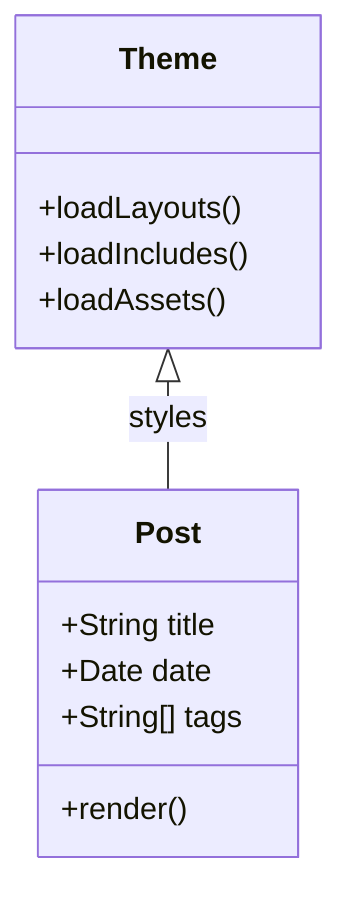

This third post validates edge cases such as long words, compact tables, and mixed markup blocks.

## Heading Coverage

### Small heading sample

Long-token test: supercalifragilisticexpialidocious-supercalifragilisticexpialidocious-supercalifragilisticexpialidocious.

#### Inline formatting sample

Use `--watch` for development, and keep **semantic HTML** for accessibility.

## Compact Table

| Key | Value |
| --- | --- |
| Theme | jekyll-academic |
| Rendering mode | static |
| Diagram engine | mermaid |
| Syntax highlighter | rouge |

## Figure

<figure class="my-3">
  
  <figcaption class="small">Figure 3. Thumbnail style image for border, shadow, and caption spacing checks.</figcaption>
</figure>

## Code Snippet

```bash
set -e
bundle install
bundle exec jekyll build
bundle exec jekyll serve --livereload --trace
```

## Mermaid Class Diagram



## Final Notes

1. Confirm heading scale consistency.
2. Confirm code blocks wrap or scroll correctly.
3. Confirm Mermaid diagrams render with expected alignment.
4. Confirm figure captions are readable on mobile.
