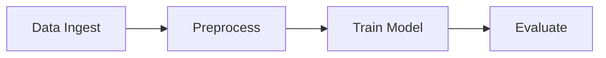

This publication page is designed for UI validation of the publications layout.

## Section Heading

### Subsection Heading

| Field | Example | Note |
| --- | --- | --- |
| Sample size | 128 | Dummy value |
| Accuracy | 0.95 | Dummy metric |
| Runtime | 4.2 s | Dummy benchmark |

<figure class="my-3">
  
  <figcaption class="text-muted">Figure 1. Placeholder figure for publication UI tests.</figcaption>
</figure>

```python
def evaluate(scores):
    return sum(scores) / len(scores)

print(evaluate([0.92, 0.96, 0.97]))
```


