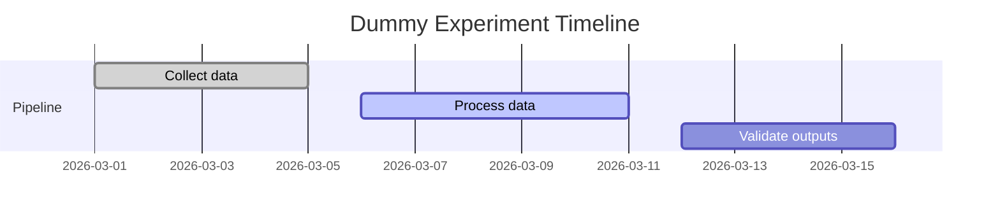

This paragraph validates baseline body typography for publication entries.

## Results Snapshot

### Metrics Table

| Case | Value |
| --- | ---: |
| Signal-to-noise | 32.4 |
| Throughput | 1.87 |
| Error rate | 0.03 |

<figure>
  
  <figcaption>Figure 4. Placeholder chart panel for visual QA.</figcaption>
</figure>

```ruby
def normalize(x, min, max)
  (x - min) / (max - min)
end

puts normalize(12, 0, 24)
```


