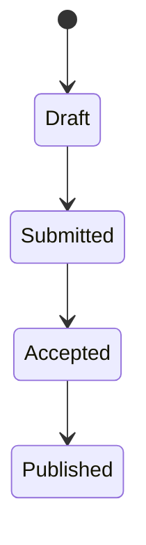

Final dummy publication for complete UI validation.

## Typography and Structure

### Quick Data Table

| Parameter | Meaning |
| --- | --- |
| alpha | Learning rate placeholder |
| beta | Smoothing term placeholder |
| gamma | Regularization placeholder |

<figure class="my-2">
  
  <figcaption>Figure 5. Image block used to test final layout behavior.</figcaption>
</figure>

```json
{
  "experiment": "dummy-05",
  "epochs": 20,
  "batch_size": 16,
  "seed": 42
}
```


