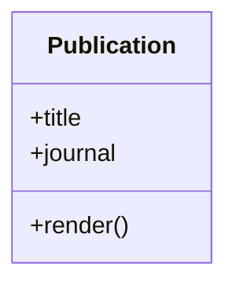

Introductory text with **bold text**, *italic text*, and `inline code`.

## Heading Test

### Table Test

| Component | Expected |
| --- | --- |
| Headings | Proper scale |
| Table | Aligned columns |
| Code | Syntax highlight |

<figure class="text-center">
  
  <figcaption class="small">Figure 3. Figure and caption spacing verification.</figcaption>
</figure>

```bash
echo "running publication ui test"
bundle exec jekyll build
```


