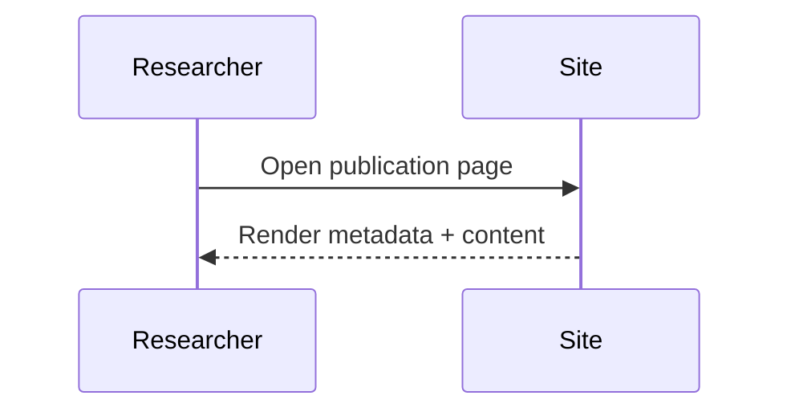

Short paragraph to validate default publication text styles.

## Visual Elements

### Data Table

| Metric | Run A | Run B |
| --- | ---: | ---: |
| Precision | 0.91 | 0.93 |
| Recall | 0.90 | 0.92 |
| F1-score | 0.90 | 0.92 |

<figure>
  
  <figcaption>Figure 2. Wide placeholder image for responsive behavior checks.</figcaption>
</figure>

```javascript
const metrics = [0.91, 0.90, 0.92];
const mean = metrics.reduce((a, b) => a + b, 0) / metrics.length;
console.log(mean.toFixed(3));
```


